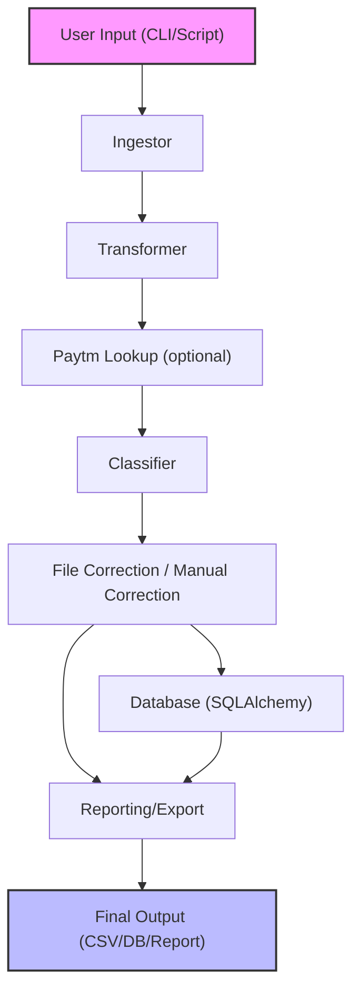

# System Architecture: Expense Classifier

## Overview

The Expense Classifier is architected as a modular, extensible ETL pipeline for financial transaction data. It is designed for robustness, scalability, and ease of extension, supporting both CLI and programmatic use cases.

---

## Architecture Diagram

---

## Component Breakdown

### 1. Ingestor
- Loads raw bank/Paytm files (CSV/XLSX)
- Standardizes columns and cleans data
- Handles messy, real-world input formats

### 2. Transformer
- Extracts transaction details (mode, payee, UPI ID, etc.)
- Adds derived columns (e.g., group, account, fiscal period)
- Normalizes and enriches data for downstream processing

### 3. Paytm Lookup (Optional)
- Matches uncategorized transactions with Paytm UPI data
- Enriches records for improved classification
- Supports both file and DB sources

### 4. Classifier
- Assigns categories using a rule-based engine (keyword-driven)
- Extensible for AI/ML-based classification
- Handles both expense and income categories

### 5. File/Manual Correction
- Exports uncategorized transactions for user review
- Allows users to add new keywords/categories
- Updates mappings for future automation

### 6. Database (SQLAlchemy)
- Stores all pipeline stages and category mappings
- Enables persistent analytics and reporting
- Alembic migrations for schema evolution

### 7. Reporting/Export
- Outputs clean, categorized data to CSV and/or database
- (Planned) hooks for dashboards and BI tools

---

## Data Flow & Extensibility

- **Pipeline Orchestration:** Each stage is a class with a clear interface, enabling easy extension or replacement.
- **Configurable:** Supports custom columns, banks, and enrichment steps via parameters.
- **Extensible:** Add new data sources, transformation logic, or classification methods with minimal code changes.
- **Persistence:** All intermediate and final data can be stored for auditability and reproducibility.

---

## Engineering Highlights

- **Separation of Concerns:** Each module handles a single responsibility.
- **Testability:** Modular design enables unit and integration testing.
- **Performance:** Vectorized operations and batch DB writes.
- **User-Centric:** Interactive correction and easy customization.
- **Scalability:** Designed to handle large datasets and evolving requirements.

---

## Scalability, Maintainability, Extensibility

- **Scalability:** Efficient pandas operations, batch processing, and DB integration support large data volumes.
- **Maintainability:** Clear module boundaries, docstrings, and type hints.
- **Extensibility:** Plug-and-play pipeline stages, easy to add new banks, categories, or enrichment logic.

---

For more, see the [main README](README.md) or [DATA_ENGINEERING.md](DATA_ENGINEERING.md). 