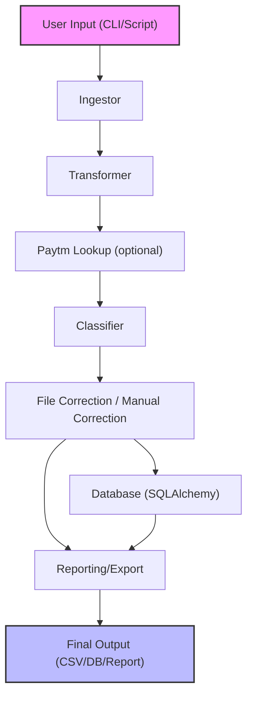

# Expense Classifier

A robust, extensible Python solution for automated expense classification, enrichment, and reporting from bank statements. Built to showcase advanced skills in software engineering, data engineering, and system design.

---

## 🚀 Introduction

**Expense Classifier** solves the tedious problem of manually categorizing and analyzing personal or business bank transactions. It ingests raw bank statements, applies intelligent classification (rule-based and AI-ready), enriches data with Paytm UPI lookups, supports manual correction, and exports clean, categorized data for reporting or further analysis.

- **Problem:** Manual expense tracking is error-prone, time-consuming, and non-scalable.
- **Solution:** An automated, modular pipeline for ingesting, transforming, classifying, and reporting on financial transactions.
- **Impact:** Saves hours of manual work, improves financial visibility, and enables data-driven decision making.

---

## ✨ Features

- **Command-Line Interface (CLI):** One-command processing of bank statements.
- **Programmatic API:** Use the pipeline in your own Python scripts.
- **Extensible Pipeline:** Modular ETL stages for easy customization and extension.
- **Database Integration:** SQLAlchemy ORM, Alembic migrations, and persistent storage.
- **Manual Correction:** Export uncategorized transactions for review and keyword enrichment.
- **Paytm UPI Support:** Enriches uncategorized records with Paytm data.
- **Reporting:** Generate clean CSVs and database tables for downstream analysis.
- **Visualization-ready:** (Planned) hooks for dashboards and visual analytics.
- **Robust Error Handling:** Validates input, handles edge cases, and logs issues.
- **Highly Configurable:** Supports multiple banks, custom columns, and user-defined categories.

[See full feature list & usage →](FEATURES.md)

---

## 🏗️ Project Architecture



- **Ingestor:** Loads and standardizes raw bank/Paytm files.
- **Transformer:** Extracts and normalizes transaction details.
- **Paytm Lookup:** Enriches uncategorized records with Paytm UPI data.
- **Classifier:** Assigns categories using rule-based (and optionally AI) logic.
- **File/Manual Correction:** Enables user-driven enrichment and learning.
- **Database:** Stores all stages and mappings for persistence and analytics.
- **Reporting/Export:** Outputs clean, categorized data for analysis or BI tools.

[Deep dive: System Architecture →](ARCHITECTURE.md)

---

## ⚙️ How It Works

1. **Ingestion:** Load CSV/XLSX bank statements, standardize columns, and clean data.
2. **Transformation:** Extract payment mode, payee, UPI ID, and derive new features.
3. **Paytm Lookup (optional):** Match uncategorized transactions with Paytm UPI data for better classification.
4. **Classification:** Assign categories using a keyword-driven, extensible rule engine.
5. **Manual/File Correction:** Export uncategorized records for user review and keyword enrichment.
6. **Publishing:** Save final, categorized data to CSV and/or database for reporting.
7. **Reporting & Visualization:** (Planned) Generate reports and dashboards for insights.

[Technical workflow details →](DATA_ENGINEERING.md)

---

## 🛠️ Technology Stack

| Layer         | Technology         | Rationale/Highlights                                 |
|---------------|-------------------|------------------------------------------------------|
| Language      | Python 3.8+       | Modern, robust, and widely used for data engineering |
| Data Handling | pandas            | Fast, flexible ETL and data manipulation             |
| ORM/DB        | SQLAlchemy        | Scalable, production-grade database integration      |
| Migrations    | Alembic           | Reliable schema evolution                            |
| CLI           | argparse          | Simple, user-friendly command-line interface         |
| Packaging     | setuptools/PEP517 | Standards-based, easy to distribute                  |
| Testing       | (Planned) pytest  | For robust, automated testing                        |
| Reporting     | pandas, CSV       | Easy export and downstream analysis                  |
| Visualization | (Planned)         | Dashboard hooks, visual analytics                    |

---

## 🧠 Design Decisions & Engineering Highlights

- **Modular Pipeline:** Each ETL stage is a separate, testable component.
- **Extensibility:** Add new banks, categories, or enrichment steps with minimal code changes.
- **Database Schema:** Normalized, extensible, and migration-ready (Alembic).
- **Error Handling:** Validates input, handles missing/invalid data, and logs issues.
- **Performance:** Vectorized pandas operations, batch DB writes, and progress storage.
- **User-Centric:** Interactive CLI, manual correction, and easy customization.
- **Real-World Ready:** Handles messy, real-world bank/UPI data and evolving requirements.

[More on design & engineering →](ARCHITECTURE.md)

---

## 🚦 Getting Started

### Installation

```bash
# Recommended: use a virtual environment
python -m venv venv
source venv/bin/activate

# Install dependencies
pip install -r requirements.txt

# Or install in editable mode
pip install -e .
```

### CLI Usage

```bash
expense-classifier --path <BANK_STATEMENT_FILE> --bank-code <BANK_CODE> --account <ACCOUNT_NAME> [options]
```

- See [FEATURES.md](FEATURES.md) for all CLI options and examples.

### Programmatic Usage

```python
from expense_classifier.pipeline import Pipeline

pipeline = Pipeline(
    bank_code="SBI",
    file_path="my_statement.csv",
    account_name="Savings Account",
    paytm_lookup=True,
    paytm_file_path="paytm.xlsx"
)
pipeline.ingest()
pipeline.transform()
pipeline.join_paytm()
pipeline.categorize()
pipeline.file_correction()
final_df, final_table, final_path = pipeline.publish_data()
```

---

## 🤝 Contributing

Contributions are welcome! Please see [CONTRIBUTING.md](CONTRIBUTING.md) for guidelines, code style, and how to get started.

---

## 📄 License

This project is licensed under the MIT License. See [LICENSE](LICENSE) for details.

---

## 👤 About the Author

**Piyush Uppreti**  
Software Engineer | Data Engineer | System Designer

- [LinkedIn](https://www.linkedin.com/in/piyush-upreti/)
- [GitHub](https://github.com/petrinax)
- Email: piyushupreti@gmail.com

---

## 📚 More Documentation

- [ARCHITECTURE.md](ARCHITECTURE.md): System architecture and design deep dive
- [FEATURES.md](FEATURES.md): Full feature list and usage examples
- [DATA_ENGINEERING.md](DATA_ENGINEERING.md): ETL/data pipeline technical details
- [CONTRIBUTING.md](CONTRIBUTING.md): Contribution guidelines
- [VISUALIZATION.md](VISUALIZATION.md): Reporting and dashboarding options


